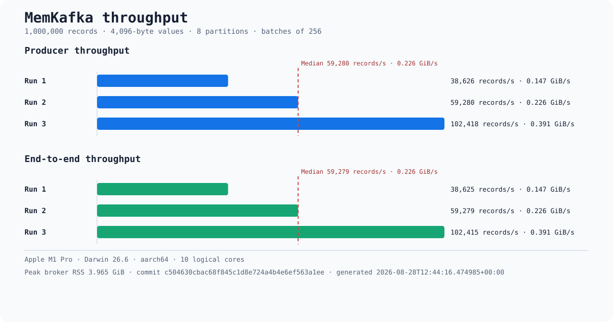

# MemKafka

[](https://github.com/jonas-lomholdt/memkafka/actions/workflows/ci.yml)

MemKafka is a fast, single-binary, in-memory Kafka-compatible broker for local development and integration tests. The same process exposes a Confluent-compatible Avro Schema Registry API.

> **Current status:** topic discovery, topic creation, Produce, Fetch, ListOffsets, partition ordering, and repeat delivery from an uncommitted offset work through four independent clients: Confluent.Kafka 2.15.0, Apache Kafka Java 4.3.1, rskafka 0.6.0, and franz-go 1.21.6. Confluent.Kafka also passes cooperative-sticky A/B/C rebalancing, automatic and explicit commits, and real Avro Schema Registry publish/consume through the pinned 2.15.0 serializer. A separate Confluent.Kafka 2.13.2 flow-profile suite proves consumer subscription auto-creation in force mode and idempotent publish/consume. Kafbat UI v1.5.0 discovers MemKafka and browses exact string and decoded Avro records with an active consumer group.

MemKafka is test infrastructure. It is not intended for production, and all state disappears when the process exits.

## Run locally

You need the Rust version pinned in `rust-toolchain.toml`.

```bash
cargo run
```

When both listeners are ready, MemKafka prints one line containing their resolved addresses.

## Run in Docker

Run the latest stable release from the public GHCR package:

```bash
docker run --rm -p 9092:9092 -p 8081:8081 \
  ghcr.io/jonas-lomholdt/memkafka:latest
```

For contributor builds from the current checkout, build and run the image locally:

```bash
docker build -t memkafka .
docker run --rm -p 9092:9092 -p 8081:8081 memkafka
```

Main publications first push a commit-addressed development tag named `sha-<full-40-character-commit>`. After the full hosted suite succeeds and `main` is rechecked for freshness, `edge` moves to that image. A registry tag is still a mutable pointer, including a `sha-*` tag; use the published OCI digest, such as `ghcr.io/jonas-lomholdt/memkafka@sha256:<digest>`, when an immutable image identity is required.

Stable releases first push the exact `MAJOR.MINOR.PATCH` tag. Mutable aliases advance monotonically from the complete set of canonical remote release tags: `MAJOR.MINOR` moves only for the highest patch in that minor, `MAJOR` only for the highest version in that major, and `latest` only for the highest stable version overall. For the first release `v0.1.0`, the resulting tags are `0.1.0`, `0.1`, `0`, and `latest`; publishing an older release later cannot move an alias backward.

The MemKafka container package is public, so `docker pull ghcr.io/jonas-lomholdt/memkafka:latest` works without credentials. GitHub does not allow a public package to be made private again; verify package visibility before publishing under a different owner or recreating the package.

The container runs as a non-root user and advertises Kafka at `127.0.0.1:9092` by default. Override the advertised address for Docker Compose or another container network:

```bash
docker run --rm \
  -p 9092:9092 \
  -p 8081:8081 \
  memkafka \
  --kafka-listen 0.0.0.0:9092 \
  --schema-registry-listen 0.0.0.0:8081 \
  --kafka-advertised-address memkafka:9092
```

## Aspire and mixed host/container clients

MemKafka deliberately uses one advertised Kafka address. When host processes and containers such as Kafbat must share it, use an IPv4-only DNS name on the host and register the same name as the Aspire container-network alias:

```csharp
const string kafkaHost = "kafka.127.0.0.1.nip.io";

var kafka = builder.AddContainer("kafka", "memkafka")
    .WithArgs(
        "--kafka-listen", "0.0.0.0:9092",
        "--schema-registry-listen", "0.0.0.0:8081",
        "--force-auto-create-topics", "true",
        "--kafka-advertised-address", $"{kafkaHost}:9092")
    .WithEndpoint(port: 9092, targetPort: 9092, name: "primary", isProxied: false)
    .WithEndpoint(port: 8081, targetPort: 8081, name: "schema-registry", scheme: "http", isProxied: false)
    .WithEndpoint("primary", endpoint => endpoint.TargetHost = "0.0.0.0")
    .WithEndpoint("schema-registry", endpoint => endpoint.TargetHost = "0.0.0.0")
    .WithContainerNetworkAlias(kafkaHost);
```

Point both host clients and container clients at `kafka.127.0.0.1.nip.io:9092`, and use `http://kafka.127.0.0.1.nip.io:8081` for Schema Registry. The explicit IPv4 name avoids `localhost` selecting `::1` on macOS. Force topic creation is useful when application consumers opt out of Kafka auto-creation.

## Defaults

| Setting | Default |
| --- | --- |
| Kafka endpoint | `127.0.0.1:9092` |
| Schema Registry | `http://127.0.0.1:8081` |
| Broker ID | `1` |
| Auto-create topics | `true` |
| Force consumer topic creation | `false` |
| Default partitions | `2` |
| Storage | Memory only |

## CLI

```text
--kafka-listen <host:port>
--kafka-advertised-address <host:port>
--schema-registry-listen <host:port>
--auto-create-topics <true|false>
--force-auto-create-topics <true|false>
--default-partitions <positive integer>
--log-level <error|warn|info|debug|trace>
--quiet
```

`--force-auto-create-topics true` is an explicit integration-test convenience. When server auto-creation is enabled, it lets named consumer subscriptions create missing topics even if the client sends `allow_auto_topic_creation=false`. The default remains Kafka-compatible and honors the client opt-out.

`--quiet` suppresses informational logs. Fatal startup errors still go to stderr.

## Compatibility target

The v0.1 target is an unmodified real `Confluent.Kafka` client plus Confluent's Avro Schema Registry integration, proven by black-box tests against pinned real client versions.

| Integration | Pinned version | Metadata and topics | Produce and Fetch | Groups and commits | Schema Registry and Avro | UI message browsing |
| --- | --- | --- | --- | --- | --- | --- |
| Confluent.Kafka (.NET) | 2.15.0 | ✅ | ✅ | ✅ | ✅ | — |
| Confluent.Kafka flow profile (.NET) | 2.13.2 | ✅ forced subscriptions | ✅ idempotent | ✅ assignment | — | — |
| Apache Kafka Java client | 4.3.1 | ✅ | ✅ | — | — | — |
| rskafka (Rust) | 0.6.0 | ✅ | ✅ | — | — | — |
| franz-go (Go) | 1.21.6 | ✅ | ✅ | — | — | — |
| Kafbat UI | 1.5.0 | ✅ | Fetch only | ✅ read-only | ✅ Avro decode | ✅ |

`✅` means the capability is verified by a black-box CI test. `✅ forced subscriptions` requires starting MemKafka with `--force-auto-create-topics true`. `—` means it is not covered by that integration's suite, not that it is known to be incompatible. The Kafbat test browses string and Confluent-framed Avro records produced by an independent franz-go client.

The current black-box suite passes independently with Confluent.Kafka 2.15.0, Apache Kafka Java 4.3.1, pure-Rust rskafka 0.6.0, and pure-Go franz-go 1.21.6 for:

- `ApiVersions` negotiation;
- Metadata lookup and automatic topic creation with two default partitions;
- explicit topic creation with a caller-selected partition count;
- clear rejection of unsupported replication factors;
- acknowledged Produce to an explicit partition;
- Fetch from an earliest or manually selected offset;
- ten sequential records observed at contiguous offsets in partition order;
- a second read from offset `0` without a commit, demonstrating in-process at-least-once redelivery.

The Confluent.Kafka suite additionally proves real asynchronous Join/Sync barriers with `cooperative-sticky`; disjoint full coverage of six partitions across consumers A, B, and C; successive incremental rounds; graceful-leave and session-expiry redistribution; explicit seeking and latest reset; automatic and explicit commit restart recovery; independent group offsets; and redelivery after restarting without a commit.

The same pinned .NET suite uses `CachedSchemaRegistryClient`, `AvroSerializer<GenericRecord>`, and `AvroDeserializer<GenericRecord>` to prove automatic registration, global IDs, subject versions, exact-schema deduplication, Confluent wire framing, successful Kafka publish/consume, and missing/unsupported-resource errors.

The separate pinned Confluent.Kafka 2.13.2 flow-profile suite proves that consumer subscriptions auto-create absent named topics in force mode, receive a real group assignment, and publish and consume ordered records through an idempotent producer.

The pinned Kafbat UI v1.5.0 suite keeps its cluster online with an active consumer group, verifies that the group is visible read-only, independently produces unique string and Avro records, and observes both topics through Kafbat's API. It requires Kafbat's message browser to return the exact string value and decoded Avro JSON through the `SchemaRegistry` serde, including the registered subject instead of falling back to raw bytes.

For Schema Registry interoperability, MemKafka exposes `GET /schemas/ids/{id}/versions` and returns every subject/version pair associated with that global schema ID. Unknown IDs return Confluent error `40403`.

MemKafka supports non-transactional idempotent production: it allocates process-local producer IDs at epoch `0`, validates producer identity and per-partition sequence numbers, and deduplicates exact recent retries without appending them again.

The broker advertises `Produce 3-7`, `Fetch 4`, `ListOffsets 1-3`, `Metadata 0-9`, `ApiVersions 0-4`, `CreateTopics 2-6`, `FindCoordinator 0-2`, `JoinGroup 0-5`, `SyncGroup 0-3`, `Heartbeat 0-3`, `LeaveGroup 0-3`, `OffsetCommit 2-7`, `OffsetFetch 1-5`, `ListGroups 0`, `DescribeGroups 0`, `InitProducerId 0`, and read-only `DescribeConfigs 1`.

See the [Kafka API parity roadmap](docs/kafka-api-parity-roadmap.md) for the Kafka 4.3 gap matrix and recommended execution order.

CI runs the Confluent Kafka + Avro suite against both the native binary and its Docker image, runs the pinned Confluent.Kafka 2.13.2 flow-profile runner against a native broker in forced-topic mode, then runs separate Java 25, Rust, Go 1.27, and Kafbat UI suites against the image.

It excludes persistence, replication, transactional IDs, transactional and control batches, transactions, exactly-once semantics, producer epoch recovery, authentication, TLS, retention, topic deletion, Protobuf, and JSON Schema.

The at-least-once guarantee applies only to acknowledged records while the MemKafka process remains running. It intentionally permits duplicate delivery after an unknown Produce outcome and does not imply durability across shutdown. `acks=0` is supported but is outside that guarantee. Automatic and explicit commits retain consumer progress only until MemKafka exits.

See the [v0.1 design specification](docs/2026-08-26-memkafka-design.md) for the exact acceptance contract and exclusions.

## License

MemKafka is open source under the [MIT License](LICENSE). Copyright © 2026 Jonas Lomholdt.

## Throughput benchmark



For the checked-in 1,000,000 × 4,096-byte workload, the median producer rate is exactly **59,279.651315284114 records/s**, the median end-to-end rate is exactly **59,278.700625094956 records/s**, and peak broker RSS is **4,257,611,776 bytes (3.965 GiB)**. This sample was measured on an Apple M1 Pro running Darwin 26.6 at commit `c504630cbac68f845c1d8e724a4b4e6ef563a1ee`; see the [raw JSON](docs/benchmarks/latest.json).

> **Machine-specific sample, not a universal performance guarantee.** Results vary with hardware, operating system, and system load.

Rerun the same benchmark from the repository root:

```bash
benchmarks/throughput/run.sh
```
